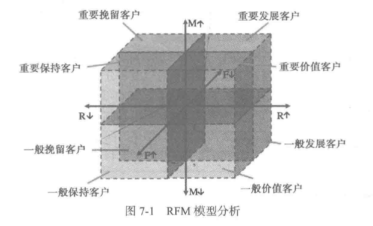

# 背景与挖掘目标
## 背景
1. 电商业务竞争激烈，从产品中心转化为客户中心。
2. 针对不同类型客户，进行精准营销，实现利润最大化。
3. 建立客户价值评估模型，进行客户分类，是解决问题的办法
## 挖掘目标
借助电商公司客户数据，对客户进行分类。
1. 对不同的客户类别进行特征分析，比较不同类客户的客户价值
2. 对不同价值的客户类别提供个性化服务，制定相应的营销策略。
3. 详情数据见数据集内容中的data.csv和客户信息属性说明

# 分析方法与过程
## 分析方法
1. 首先，明确目标是客户价值识别。

2. 识别客户价值，应用最广泛的模型是三个指标（消费时间间隔（Recency）,消费频率（Frequency）,消费金额（Monetary））

3. 以上指标简称RFM模型，作用是识别高价值的客户

  * 消费金额，一般表示一段时间内，消费的总额。
  * 消费间隔，指最近一次会员来店铺购买的时间
  * 会员在限定的期间内所购买的次数。
  * 一般的电商平台都会采用会员体系，所以要引入会员参考标准，用户的入会时间长短能在一定程度上影响客户价值，所以增加指标L=入会时间长度=客户关系长度。
  * 积分的数量评判用户消费的累积，所以增加M=用户积分优惠
4. 如果采用传统的RFM模型，如下图。它是依据，各个属性的平均值进行划分，但是，细分的客户群太多，精准营销的成本太高。


## 挖掘步骤
1. 选择性抽取与新增数据抽取，形成历史数据和增量数据
2. 对步骤一的两个数据，进行数据探索性分析和预处理，主要有缺失值与异常值的分析处理，属性规约、清洗和变换
3. 利用步骤2中的已处理数据作为建模数据，基于用户价值的LRFMC模型进行客户分群，对各个客户群再进行特征分析，识别有价值客户。
4. 针对模型结果得到不同价值的客户，采用不同的营销手段，指定定制化的营销服务，或者针对性的优惠与关怀。（重点维护老客户）

### 数据抽取
1. 选取，2017-03-31为结束时间，选取宽度为两年的时间段，作为观测窗口，抽取观测窗口内所有客户的详细数据，形成历史数据
2. 对于后续新增的客户信息，采用目前的时间作为重点，形成新增数据
### 探索性分析
本案例的探索分析，主要对数据进行缺失值和异常值分析。
电商数据中不同的异常值，采用不同的替换方式。
查找每列属性观测值中空值的个数、最大值、最小值的代码如下。
```
#-*- coding: utf-8 -*-
#对数据进行基本的探索
#返回缺失值个数以及最大最小值

import pandas as pd

datafile= r'/home/na/input/date27730/user_data.csv' #用户原始数据,第一行为属性标签
resultfile = r'/home/na/work/test.xls' #数据探索结果表

data = pd.read_csv(datafile, encoding = 'utf-8') #读取原始数据，指定UTF-8编码（需要用文本编辑器将数据装换为UTF-8编码）
explore = data.describe(percentiles = [], include = 'all').T #包括对数据的基本描述，percentiles参数是指定计算多少的分位数表（如1/4分位数、中位数等）；T是转置，转置后更方便查阅
print(explore)
explore['null'] = len(data)-explore['count'] #describe()函数自动计算非空值数，需要手动计算空值数

explore = explore[['null', 'max', 'min']]
explore.columns = [u'空值数', u'最大值', u'最小值'] #表头重命名
print('-----------------------------------------------------------------以下是处理后数据')
print(explore)
'''这里只选取部分探索结果。
describe()函数自动计算的字段有count（非空值数）、unique（唯一值数）、top（频数最高者）、freq（最高频数）、mean（平均值）、std（方差）、min（最小值）、50%（中位数）、max（最大值）'''
```

### 数据预处理
```
import pandas as pd

datafile= '/home/na/input/date27730/user_data.csv' #用户原始数据,第一行为属性标签
cleanedfile = '' #数据清洗后保存的文件

data = pd.read_csv(datafile,encoding='utf-8') #读取原始数据，指定UTF-8编码（需要用文本编辑器将数据装换为UTF-8编码）

data = data[data['SUM_YR_1'].notnull() & data['SUM_YR_2'].notnull()] #票价非空值才保留

#只保留票价非零的，或者平均折扣率与总飞行公里数同时为0的记录。
index1 = data['SUM_YR_1'] != 0
index2 = data['SUM_YR_2'] != 0
index3 = (data['SEG_KM_SUM'] == 0) & (data['avg_discount'] == 0) #该规则是“与”,书上给的代码无法正常运行，修改'*'为'&'
data = data[index1 | index2 | index3] #该规则是“或”
print(data)
# data.to_excel(cleanedfile) #导出结果
```
### 属性规约
原始数据中属性太多，根据客户价值LRFMC模型，选择与模型相关的六个属性。   
删除其他无用属性，如会员卡号等   

### 数据变换
1. 将原始数据转换成“适当”的格式，用来适应算法和分析等等的需要。
2. 本案例，主要采用数据变换的方式为属性构造和数据标准化
3. 需要构造LRFMC的五个指标
L=LOAD_TIME-FFP_DATE(会员入会时间距观测窗口结束的月数=观测窗口的结束时间-入会时间（单位：月）)
R=LAST_TO_END（客户最近一次购买距观测窗口结束的月数=最后一次）
F=FLIGHT_COUNT(客户在观测窗口期内购买次数)
M=SEG_KM_SUM(会员积分)
C=AVG_DISCOUNT(会员折扣)
```
def reduction_data(data):
    data = data[['LOAD_TIME', 'FFP_DATE', 'LAST_TO_END', 'FLIGHT_COUNT', 'SEG_KM_SUM', 'avg_discount']]
    # data['L']=pd.datetime(data['LOAD_TIME'])-pd.datetime(data['FFP_DATE'])
    # data['L']=int(((parse(data['LOAD_TIME'])-parse(data['FFP_ADTE'])).days)/30)
    d_ffp = pd.to_datetime(data['FFP_DATE'])
    d_load = pd.to_datetime(data['LOAD_TIME'])
    res = d_load - d_ffp
    data2=data.copy()
    data2['L'] = res.map(lambda x: x / np.timedelta64(30 * 24 * 60, 'm'))
    data2['R'] = data['LAST_TO_END']
    data2['F'] = data['FLIGHT_COUNT']
    data2['M'] = data['SEG_KM_SUM']
    data2['C'] = data['avg_discount']
    data3 = data2[['L', 'R', 'F', 'M', 'C']]
    return data3

data3=reduction_data(data)
print(data3)
```
```
def zscore_data(data):
    data = (data - data.mean(axis=0)) / data.std(axis=0)
    data.columns = ['Z' + i for i in data.columns]
    return data

data4=zscore_data(data3)
data4
```
## 模型构建
### 客户聚类
```
nputfile = r'/home/na/input/date27730/zscoreddata.xls' #待聚类的数据文件
k = 5                       #需要进行的聚类类别数

#读取数据并进行聚类分析
data = pd.read_excel(inputfile) #读取数据

#调用k-means算法，进行聚类分析
kmodel = KMeans(n_clusters = k, n_jobs = 4) #n_jobs是并行数，一般等于CPU数较好
kmodel.fit(data) #训练模型

r1 = pd.Series(kmodel.labels_).value_counts()
r2 = pd.DataFrame(kmodel.cluster_centers_)
r = pd.concat([r2, r1], axis=1)
r.columns = list(data.columns) + ['类别数目']
# print(r)
# r.to_excel(classoutfile,index=False)

r = pd.concat([data, pd.Series(kmodel.labels_, index=data.index)], axis=1)
r.columns = list(data.columns) + ['聚类类别']
print(kmodel.cluster_centers_)
print(kmodel.labels_)
r
```
```
def density_plot(data):
    plt.rcParams['font.sans-serif']=['SimHei']
    plt.rcParams['axes.unicode_minus']=False
    p=data.plot(kind='kde',linewidth=2,subplots=True,sharex=False)
    [p[i].set_ylabel('密度') for i in range(5)]
    [p[i].set_title('客户群%d' %i) for i in range(5)]
    plt.legend()
    plt.show()
    return plt
density_plot(data4)
```
### 结果分析
根据建立模型，得出图形化结果。
### 模型应用
模型应用
会员的升级与保级（积分兑换原理相同） 会员可以分为不同等级，享受不同优惠 部分客户会因为不了解自身积分情况，错失升级机会，客户和公司都会有损失。
1. 在会员接近升级前，对高价值客户进行促销活动，刺激他们消费达到标准，双方获利
2. 交叉销售 增强业务与本公司联系，提高忠诚度。
3. 管理模式 企业要获得长期的丰厚利润，必须需要大量稳定的、高质量的客户。 维持老客户的成本远远低于新客户，保持优质客户是十分重要的。 精准营销中，也有成本因素，所以按照客户价值排名，进行优先的，特别的营销策略，是维持客户的关键。
